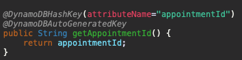
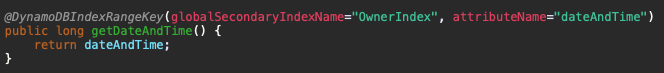
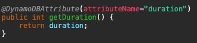
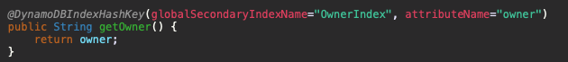

# Report

## Appointment class
The appointment class has been setup such that it consists of a *String* value for identifying an appointment, a long value containing the date and time of the appointment as the number of milliseconds since 01/01/1970, the duration of the appointment in minutes as an *Integer*, the owner of the appointment as a *String*, and the description of the appointment as a *String*.

### Annotations

#### Appointment ID
The appointment ID has been provided with both the *DynamoDBHashKey* and *DynamoDBAutogeneratedKey* annotations. The hash key annotation ensures that the class property is mapped to the partition key of the table. The auto generated key annotation ensures that the system automatically generates an ID for an appointment. Specifically, the *DynamoDBMapper* generates a random UUID, which represents a 128-bit value. 

#### Date and time 
The *dateAndTime* field has been provided the *DynamoDBIndexRangeKey* annotation with a global secondary index (GSI) name of *"OwnerIndex"*. The index range key is used here as it allows querying a global secondary index and the refining of results using the index sort key discussed below. In particular, using a GSI here enables me to use a *DynamoDBQueryExpression* as opposed to a *DynamoDBScanExpression* for retrieving appointments that belong to a specific owner between two specified dates and times. 

#### Duration
The duration field has been mapped with the simple *DynamoDBAttribute* annotation which simply maps a property to a table attribute. As shown by the image below, the *DynamoDBAttribute* maps the *duration* property to the duration attribute name in the table. 

#### Owner
As was briefly mentioned when discussing the *dateAndTime* attribute, the GSI was made use of to refine results using the index sort key. 

