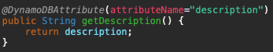
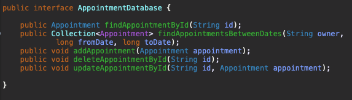
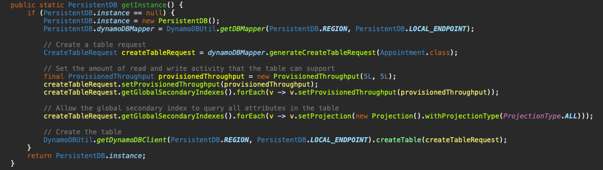

# Report

## Appointment class
The appointment class has been setup such that it consists of a *String* value for identifying an appointment, a long value containing the date and time of the appointment as the number of milliseconds since 01/01/1970, the duration of the appointment in minutes as an *Integer*, the owner of the appointment as a *String*, and the description of the appointment as a *String*.

### Annotations

#### Appointment ID
The appointment ID has been provided with both the *DynamoDBHashKey* and *DynamoDBAutogeneratedKey* annotations. The hash key annotation ensures that the class property is mapped to the partition key of the table. The auto generated key annotation ensures that the system automatically generates an ID for an appointment. Specifically, the *DynamoDBMapper* generates a random UUID, which represents a 128-bit value. 


#### Date and time 
The *dateAndTime* field has been provided the *DynamoDBIndexRangeKey* annotation with a global secondary index (GSI) name of *"OwnerIndex"*. The index range key is used here as it allows querying a global secondary index and the refining of results using the index sort key discussed below. In particular, using a GSI here enables me to use a *DynamoDBQueryExpression* as opposed to a *DynamoDBScanExpression* for retrieving appointments that belong to a specific owner between two specified dates and times. 


#### Duration
The duration field has been mapped with the simple *DynamoDBAttribute* annotation which simply maps a property to a table attribute. As shown by the image below, the *DynamoDBAttribute* maps the *duration* property to the duration attribute name in the table. 


#### Owner
As was briefly mentioned when discussing the *dateAndTime* attribute, the GSI was made use of to refine results using the index sort key. Thus, using the index hash key for the owner maps 


#### Description 
Similar to the duration field, the description has also been mapped with a *DynamoDBAttribute* annotation simply mapping the property to a table attribute.



## Web Services

### AppointmentDatabase 
The *AppointmentDatabase* is an interface which consists of all the required operations. In particular, I've provided methods for finding an appointment given by its ID, for finding appointments for a specific owner between two specified dates, for adding a new appointment, deleting an appointment given its ID and for updating an appointment given its ID and new attribute values. 



### PersistentDB
The *PersistentDB* class implements the *AppointmentDatabase* interface in order to handle all the necessary logic for each database operation. In addition, the *PersistentDB* class consists of all the required configurations for generating a new instance of a DynamoDB table. I've configured the DynamoDB table name as *cm4108-coursework*, the region to local, and the local endpoint to port 8000. 

#### Creating a new instance
As shown by the image below, I've decided to create a new DynamoDB table programmatically. First, we determine if the current database instance is null. If this is the case, a new instance is created using the *generateCreateTableRequest* function provided by the *DynamoDBMapper* class. Next, we set the amount of read and write activity that the table can support. It's important to note that a global secondary index has no size limitations and has its own provisioned throughput settings for read and write activity which are separate from the table. Therefore, the values for the provisioned throughout need to be set separately. 

```java
createTableRequest.getGlobalSecondaryIndexes.forEach(v -> v.setProvisionedThroughput(provisionedThroughput)
```

