# Report

## Appointment class
The appointment class has been setup such that it consists of a *String* value for identifying an appointment, a long value containing the date and time of the appointment as the number of milliseconds since 01/01/1970, the duration of the appointment in minutes as an *Integer*, the owner of the appointment as a *String*, and the description of the appointment as a *String*.

### Annotations

#### Appointment ID
The appointment ID has been provided with both the *DynamoDBHashKey* and *DynamoDBAutogeneratedKey* annotations. The hash key annotation ensures that the class property is mapped to the partition key of the table. The auto generated key annotation ensures that the system automatically generates an ID for an appointment. Specifically, the *DynamoDBMapper* generates a random UUID, which represents a 128-bit value. 


#### Date and time 
The *dateAndTime* field has been provided the *DynamoDBIndexRangeKey* annotation with a global secondary index (GSI) name of *"OwnerIndex"*. The index range key is used here as it allows querying a global secondary index and the refining of results using the index sort key discussed below. In particular, using a GSI here enables me to use a *DynamoDBQueryExpression* as opposed to a *DynamoDBScanExpression* for retrieving appointments that belong to a specific owner between two specified dates and times. 


#### Duration
The duration field has been mapped with the simple *DynamoDBAttribute* annotation which simply maps a property to a table attribute. As shown by the image below, the *DynamoDBAttribute* maps the *duration* property to the duration attribute name in the table. 


#### Owner
As was briefly mentioned when discussing the *dateAndTime* attribute, the GSI was made use of to refine results using the index sort key. Thus, using the index hash key for the owner maps...


#### Description 
Similar to the duration field, the description has also been mapped with a *DynamoDBAttribute* annotation simply mapping the property to a table attribute.


## Web Services

### AppointmentDatabase 
The *AppointmentDatabase* is an interface which consists of all the required operations. In particular, I've provided methods for finding an appointment given by its ID, for finding appointments for a specific owner between two specified dates, for adding a new appointment, deleting an appointment given its ID and for updating an appointment given its ID and new attribute values. 


### PersistentDB
The *PersistentDB* class implements the *AppointmentDatabase* interface in order to handle all the necessary logic for each database operation. In addition, the *PersistentDB* class consists of all the required configurations for generating a new instance of a DynamoDB table. I've configured the DynamoDB table name as *cm4108-coursework*, the region to local, and the local endpoint to port 8000. 

#### Creating a new instance
As shown by the image below, I've decided to create a new DynamoDB table programmatically. First, we determine if the current database instance is null. If this is the case, a new instance is created using the *generateCreateTableRequest* function provided by the *DynamoDBMapper* class. Next, we set the amount of read and write activity that the table can support. It's important to note that a global secondary index has no size limitations and has its own provisioned throughput settings for read and write activity which are separate from the table. Therefore, the values for the provisioned throughput need to be set separately. This is being done using the snippet of code shown below.

```java
createTableRequest.getGlobalSecondaryIndexes.forEach(v -> v.setProvisionedThroughput(provisionedThroughput);
```

Furthermore, we need to allow the global secondary index to query all the attributes in the table. By default, the projection type is set to *KEYS_ONLY* which ensures that only the index and primary keys are projected into the index. Whereas, when using the projection type *ALL*, we are ensuring that all of the table attributes are being projected. This is being done using the following snippet of code. 

```java
createTableRequest.getGlobalSecondaryIndexes().forEach(v -> v.setProjection(new Projection().withProjectionType(ProjectionType.ALL)));
```


#### Finding an appointment given its ID
In order to retrieve an appointment by its ID, I simply make use of the *load* function provided by the *DynamoDBMapper* where I pass in the appointment class as well as the partition/hash key of the appointment. 

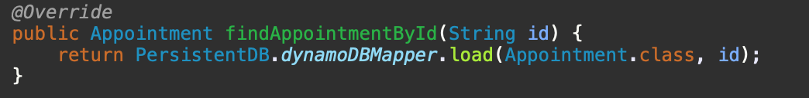

#### Adding an appointment 
In order to add an appointment, I define a new appointment object and pass in the form-filled parameters. I then use the mapper to persist the appointment object. 

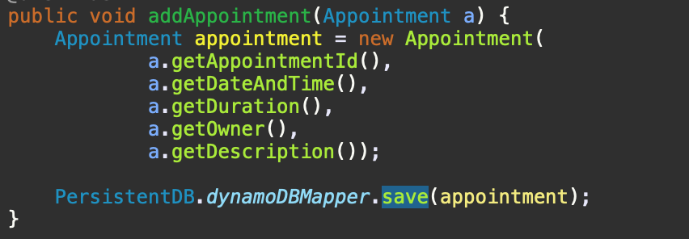

#### Deleting an appointment
To delete an appointment, I first load the load the appointment object using the partition/hash key. I then check if the object exists, and if this is the case the appointment is simply deleted using the mapper *delete* function. 

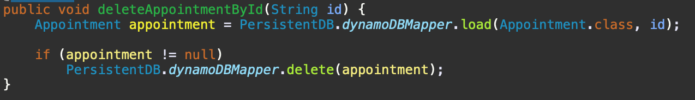

#### Updating an appointment 
To update an appointment, I first load the appointment object using the partition/hash key. Next, I check if the appointment to update exists. If it does, then the loaded appointment is updated with the client side form-filled parameters. 

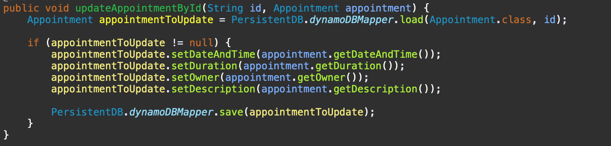

#### Retrieving appointments between two dates
In order to retrieve appointments between two dates for a specific user, I first define a new HashMap for storing the expression attribute values. Using a *DynamoDBQueryExpression*, I then query the index to retrieve a subset of appointments for the specified owner between the 2 long values for dates. It's essential to specify the index name so that DynamoDB knows which index to query. Thus, I specify the index name as *OwnerIndex* as this is the global secondary index name I decided to make use of for both the index hash key and index range key as discussed above. 

The retrieval of appointments between two dates for a specific owner can also be done using a *DynamoDBScanExpression*, however, scanning works through the whole table and can be quite expensive if the table is big. Querying, on the other hand, works by searching on key and is therefore more efficient. Evidently, for a simple application such as a personal diary, you most likely do not need to take into account the use of a query expression as your database likely won't contain hundreds of entries, thus, I have made use of a query expression solely for demonstration purposes. I've also included a function for scanning the appointments as opposed to querying as can be seen by the images below. Out of curiosity, for both the querying and scanning functions I calculate the time it takes to run each operation and as shown in section X, the test cases prove that with less than 100 appointments in the database, a scan expression can at some cases run faster than a query expression. 

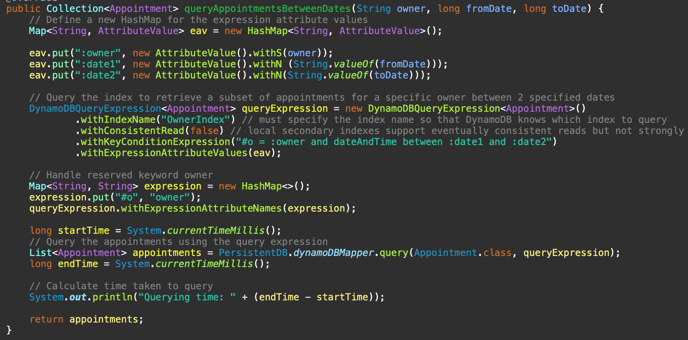
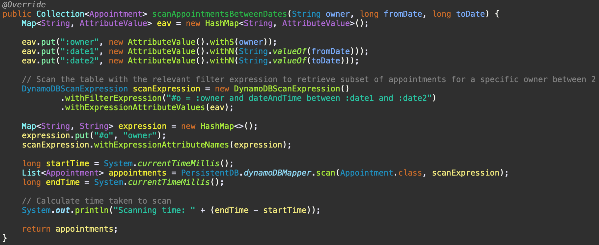

### AppointmentResource 

#### Adding a new appointment 
In order to add a new appointment, I specify the method to handle post requests using the *@POST* annotation from JAX-RS. Furthermore, I set the response content-type to plain text such that the server can respond with a status code and a plain-text response. If the adding of an appointment is successful, the server replies with a 201 status code implying that the appointment was successfully added to the database. If the adding of an appointment is unsuccessful, the server responds with a 400 status code to indicate that something went wrong. 

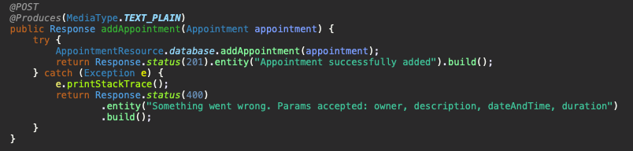

#### Retrieving an appointment by its ID 
Here, I specify the method to handle get requests using the *@GET* annotation from JAX-RS. Additionally, I specify the response content-type as JSON and append the appointment ID to the path. The appointment is then retrieved from the database using the *findAppointmentById(id)* function mentioned above. If the appointment exists, I simply return the appointment, whereas, if the appointment cannot be found, I return a new *AppointmentNotFoundException* which is a custom exception case that extends the *WebApplicationException* class. The exception returns a 404 status code to imply that the appointment was not found with the given ID.

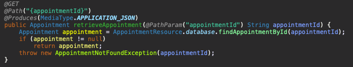
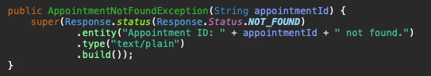

#### Retrieving appointments between two specified dates
To retrieve appointments for a specific owner between 2 specified dates, I also make use of the *@GET* annotation in order to handle the request. I append the owner, the start date, and the date to the path in which I separate each path parameter with a slash. The appointments for the owner can then be retrieved by either using the *queryAppointmentsBetweenDates* or *scanAppointmentsBetweenDates* function. If the appointments between the two given dates for the specified owner are found, then the appointments are simply returned as JSON, whereas, if the appointments cannot be found, a *AppointmentsNotFoundException* is returned which simply indicates to the user that the appointments for the specific owner could not be found. 

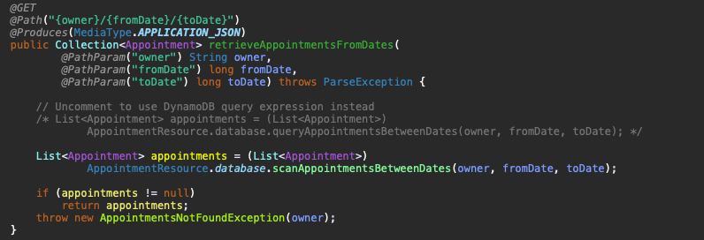
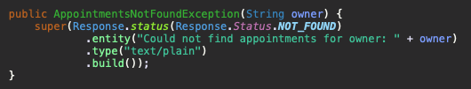

#### Deleting an appointment given by its ID


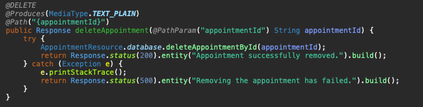

#### Updating an appointment given by its ID 

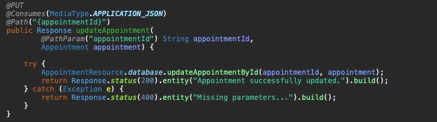

## Client side 

#### Adding a new appointment 
To add a new appointment into the database, I make use of the jQuery Ajax function where I specify the type as 'PUT' as well as other necessary parameters. Most importantly, I pass in the data using the *formToJSON()* function shown below. This function converts the form entries into a JSON object using the *JSON.stringify()* method. If the adding of a new appointment is successful, I alert the client with the success message received from the back-end, whereas if if the adding is unsuccessful I alert the client with the error message.   

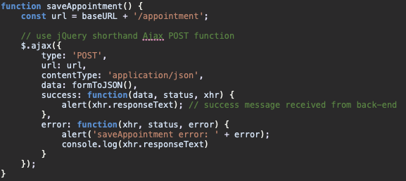
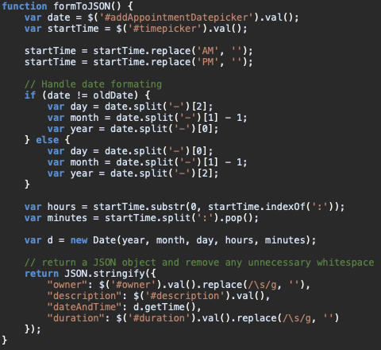


#### Updating an appointment by its ID
Similar to adding a new appointment, for updating an appointment I make use of the jQuery Ajax function where I specify the type as 'PUT' as well as pass in the data using the *formToJSON()* method mentioned above to convert the form entries into a JSON object. If the updating on an appointment is successful, I alert the client with the successful response message retrieved from the back-end, and with the error message if the updating failed. 

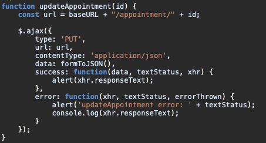

#### Deleting an appointment by its ID
Likewise to updating an adding an appointment, when deleting an appointment given by its ID, I use the Ajax function in which I specify the type as 'DELETE', pass in the url, and alert the client with either the success message, or error message received from the back-end. 

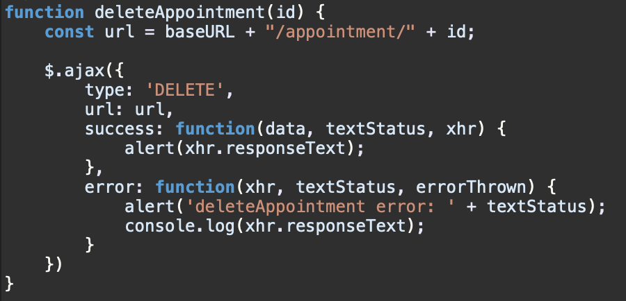

#### Retrieving appointments for a specific owner between two dates
In order to retrieve the appointments between two different dates, I make use of the jQuery shorthand Ajax function to retrieve the JSON data. Using a *forEach* loop, I retrieve all fields for each appointment. Since the date is being sent from the back-end to the front-end as a long value (timestamp), it's essential to convert the value to a JavaScript date object.

```javascript
var date = new Date(dateTime);
```

Once converted to a date object, I can simply receive the hours from the date object using:

```javascript
var hours = date.getHours();
```

as well as the minutes using: 

```javascript
var minutes = date.getMinutes();
```

Using the hours, minutes and duration I'm able to calculate the time when an appointment ends and display the appointment details in a clear and concise format as can be seen by the image below. 


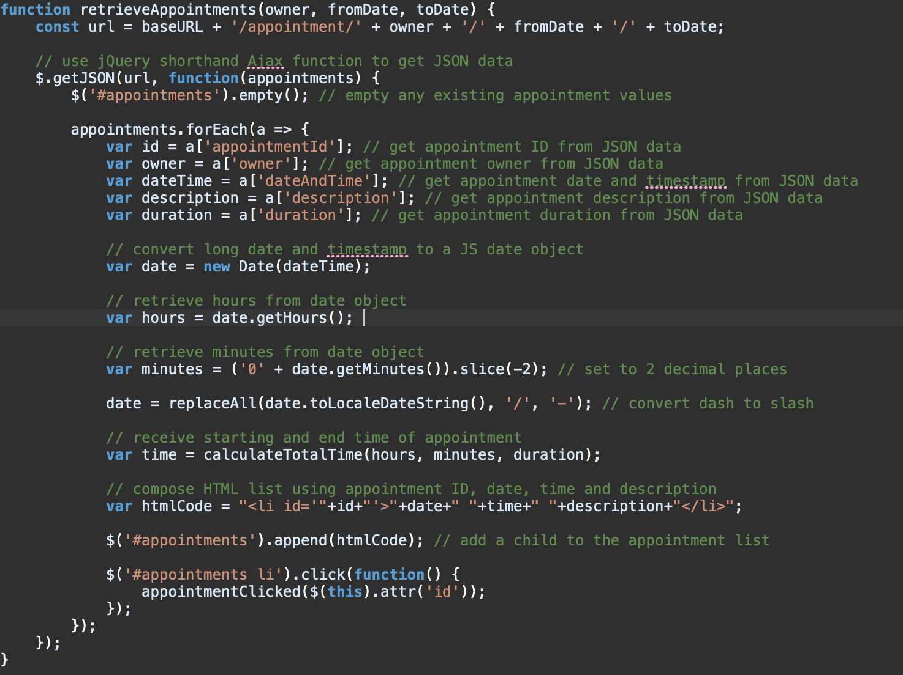